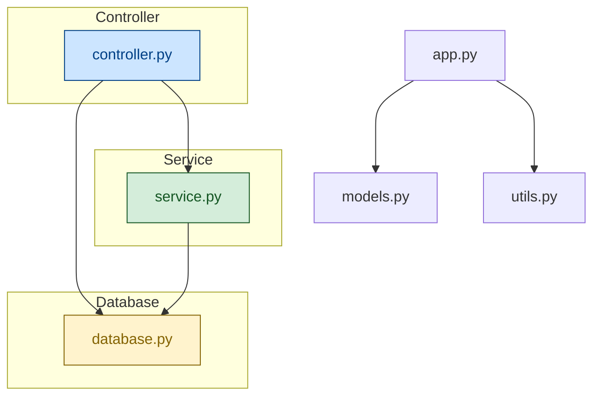

# Module Dependency Diagram

```mermaid
flowchart TD
    subgraph controller_layer["Controller"]
        controller["controller.py"]
    end
    subgraph database_layer["Database"]
        database["database.py"]
    end
    subgraph service_layer["Service"]
        service["service.py"]
    end
    app["app.py"]
    models["models.py"]
    utils["utils.py"]

    app --> models
    app --> utils
    controller --> database
    controller --> service
    service --> database

    classDef controllerStyle fill:#cce5ff,stroke:#004085,color:#004085;
    classDef databaseStyle fill:#fff3cd,stroke:#856404,color:#856404;
    classDef serviceStyle fill:#d4edda,stroke:#155724,color:#155724;
    class controller controllerStyle;
    class database databaseStyle;
    class service serviceStyle;
```
